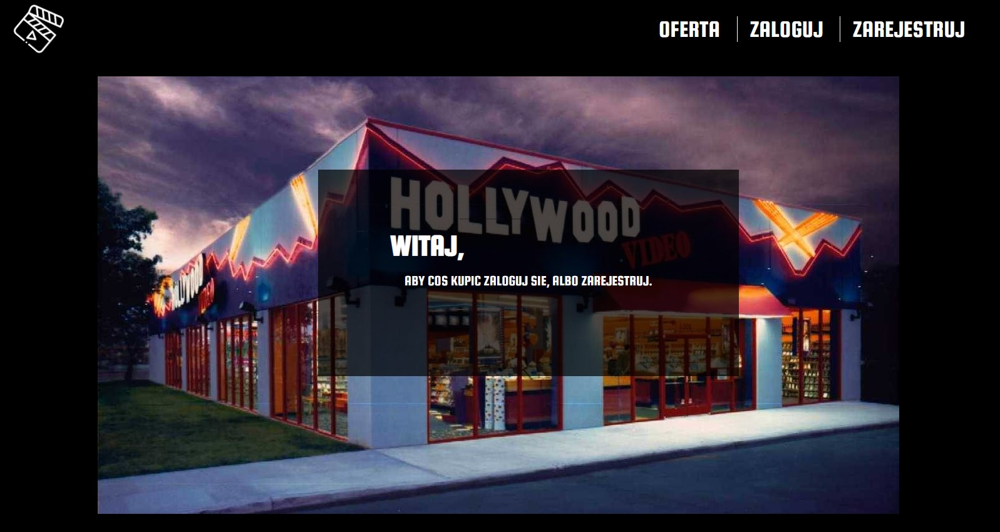
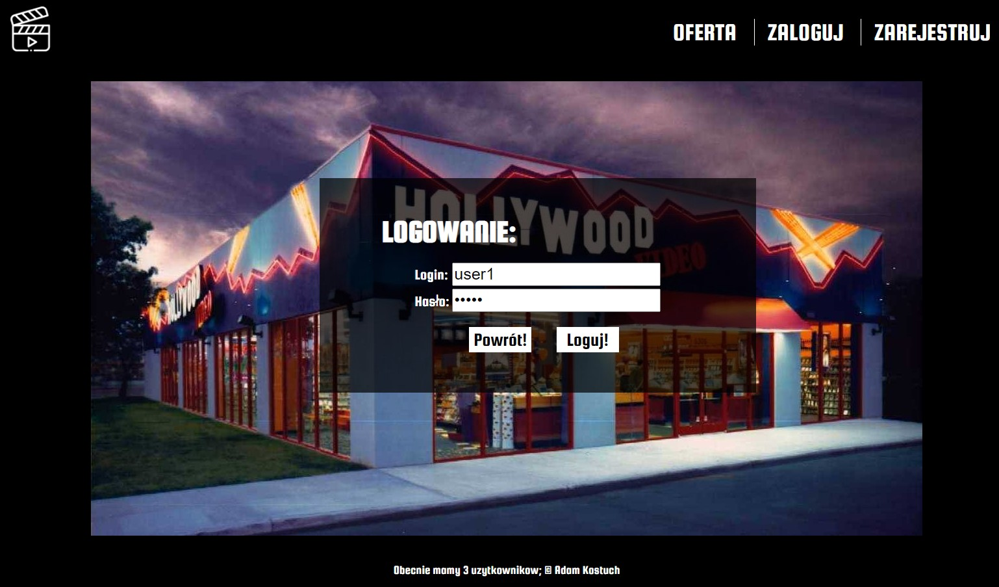
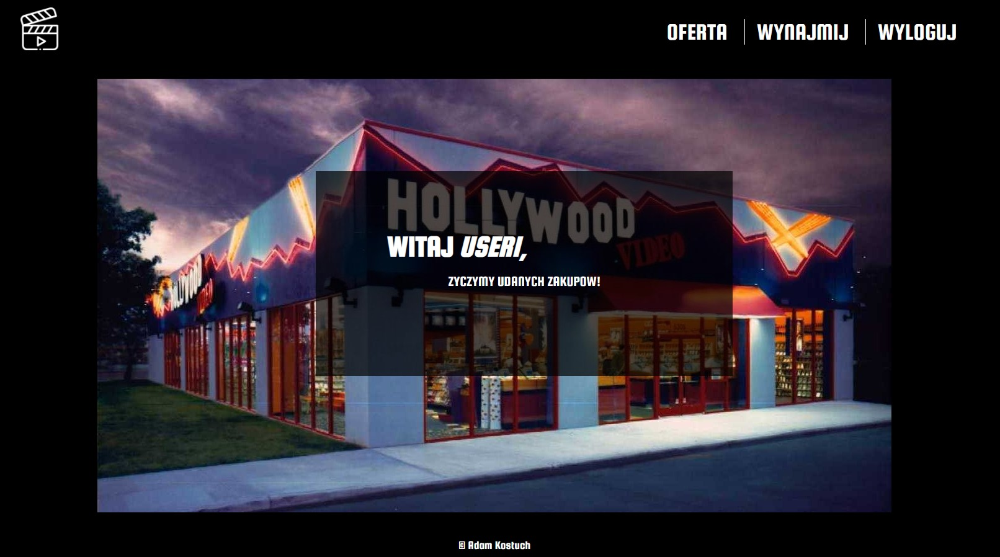
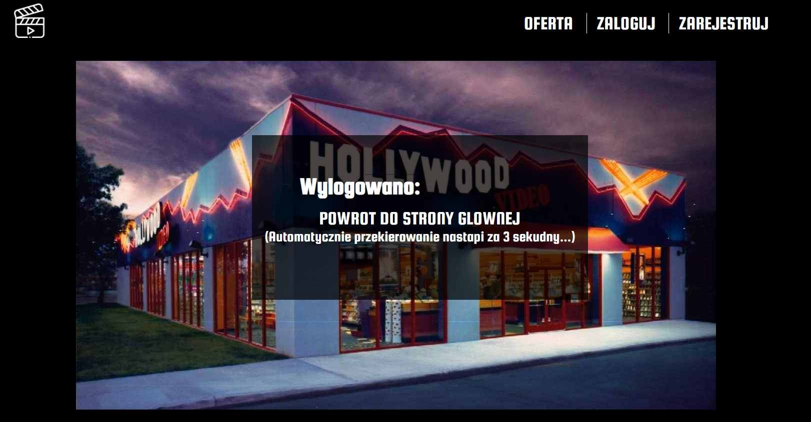

# Movie Rental

## Table of Content:
  - [About](#about)
  - [Instalation](#instalation)
  - [Preview](#preview)

----
### About
Movie rental is PHP orientet project made for school subject. Code is wrote in English, but the text in the website is mostly in Polish. The project requires SQL database `wypozyczalnia_filmow.sql`, on which the code is based on. Techonologies used to this project: 
  - HTML5
  - CSS3
  - PHP 
  - CRUD 
  
### Instalation
To install the project, follow seps: 
  1. Donwload this repository (ex. as a ZIP folder)
  2. Extract it to XAMPP Control Panel folder (most common path: `C:\xampp\htdocs`)
  3. Import the database to PHPMyAdnim local server. 
  4. Open the project in your browser (`localhost/wypozyczalnia_filmów`)
  
### Preview 
Few possible interactions: 

